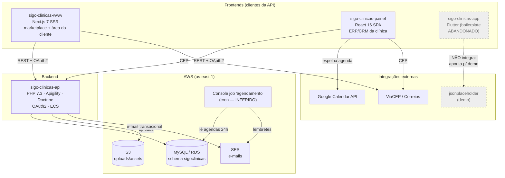

# Diagrama — Arquitetura geral

Relações **confirmadas** em linha cheia; **inferidas** marcadas no rótulo.

```mermaid
graph TD
    subgraph Clientes["Frontends (clientes da API)"]
        WWW["sigo-clinicas-www<br/>Next.js 7 SSR<br/>marketplace + área do cliente"]
        PAINEL["sigo-clinicas-painel<br/>React 16 SPA<br/>ERP/CRM da clínica"]
        APP["sigo-clinicas-app<br/>Flutter (boilerplate<br/>ABANDONADO)"]
    end

    subgraph Backend["Backend"]
        API["sigo-clinicas-api<br/>PHP 7.3 · Apigility · Doctrine<br/>OAuth2 · ECS"]
    end

    subgraph AWS["AWS (us-east-1)"]
        DB[("MySQL / RDS<br/>schema sigoclinicas")]
        S3[("S3<br/>uploads/assets")]
        SES["SES<br/>e-mails"]
        CRON["Console job 'agendamento'<br/>(cron — INFERIDO)"]
    end

    subgraph Externos["Integrações externas"]
        GCAL["Google Calendar API"]
        VIACEP["ViaCEP / Correios"]
        JSONPH["jsonplaceholder<br/>(demo)"]
    end

    WWW -->|REST + OAuth2| API
    PAINEL -->|REST + OAuth2| API
    APP -.->|NÃO integra:<br/>aponta p/ demo| JSONPH

    PAINEL -->|espelha agenda| GCAL
    PAINEL -->|CEP| VIACEP
    WWW -->|CEP| VIACEP

    API --> DB
    API -->|uploads| S3
    API -->|e-mail transacional| SES
    CRON -->|lê agendas 24h| DB
    CRON -->|lembretes| SES

    classDef abandoned fill:#eee,stroke:#999,stroke-dasharray: 5 5,color:#666;
    class APP,JSONPH abandoned;
```
