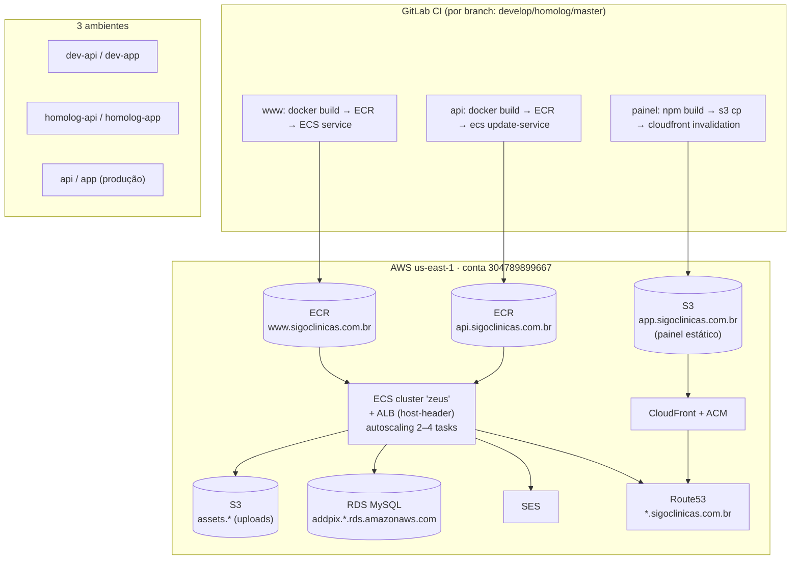

# Diagrama — Deploy e infraestrutura (AWS us-east-1)

**Divergências/alertas (ver docs/07 e docs/09)**
- `cloudformation.yaml` usa `sigoclinicas.com`; CI/e-mails usam
  `sigoclinicas.com.br`.
- Painel é **estático (S3+CloudFront)**; site e API rodam em **container ECS**.
- Segredos AWS/SES **hardcoded** em `Dockerfile`/`docker-compose.yml` da API.
- `bedin-www` publicaria nesta **mesma** infra sigoclinicas (pipeline não
  ajustado) — risco de deploy cruzado.
- Observabilidade e rollback: **não versionados** (health check ALB em `/`).
