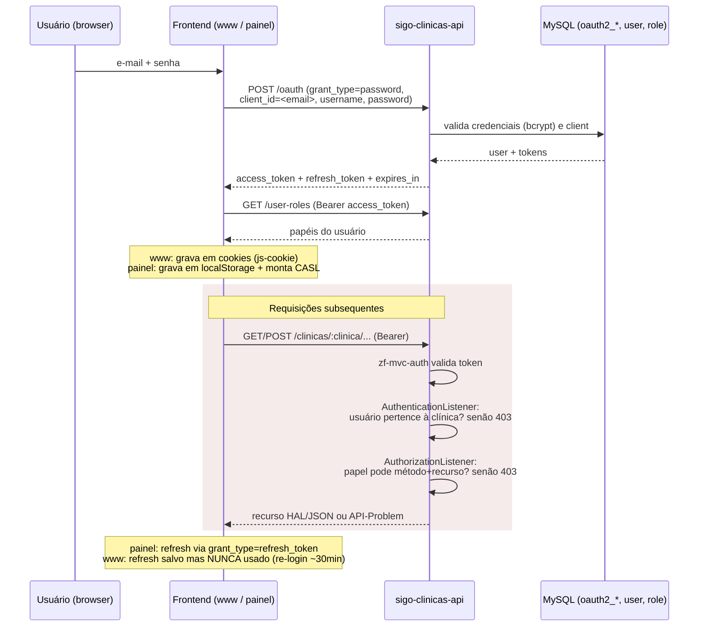

# Diagrama — Fluxo de autenticação (OAuth2 password grant)

**Fronteira de confiança**: a autorização do painel (CASL em localStorage) é
apenas UX. A decisão real de acesso está **inteiramente na API**
(`AuthorizationListener` + `AuthenticationListener`). Ver `docs/06`.
