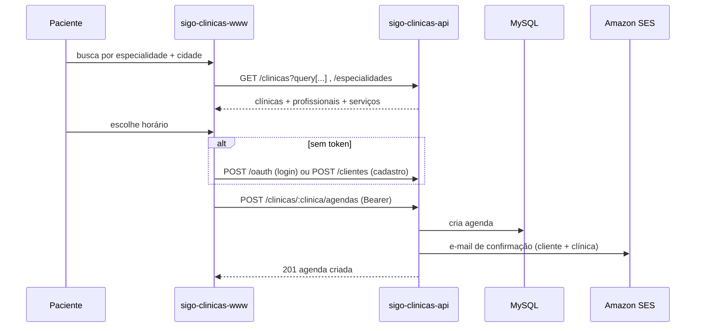
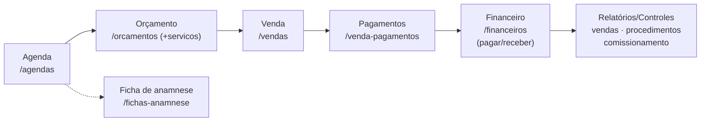
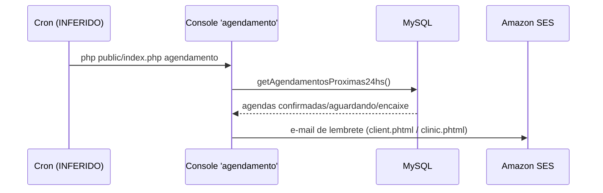

# Diagrama — Fluxo principal (agendamento e funil comercial)

## A) Paciente agenda online (B2C, via www)

## B) Funil B2B na clínica (via painel)

## C) Lembrete de agendamento (job de console)

