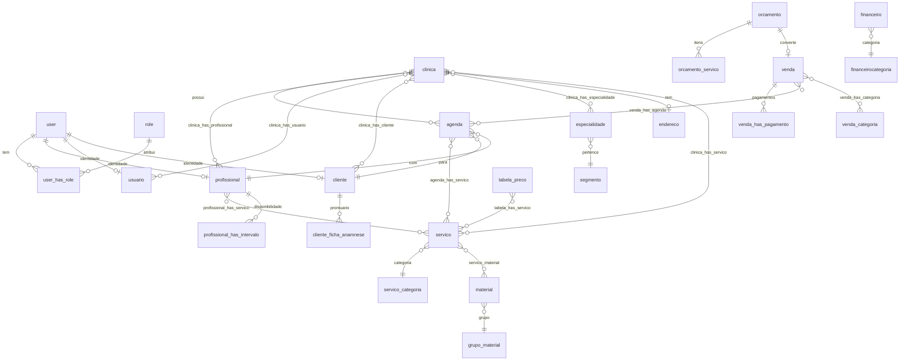

# Diagrama — Modelo de dados (principais entidades)

Simplificado a partir de `assets/mysql/dump.sql` e dos mapeamentos Doctrine.
Tabelas pivô `*_has_*` representadas como relações N:N.

> **Divergência conhecida**: a entidade `ClientesStatusEntity` referencia a
> tabela `clinica_cliente_status`, **ausente do dump** (existe apenas
> `clinica_has_cliente`). Ver `docs/04` e `docs/09` (R10). Não incluída acima por
> não existir no schema versionado.
