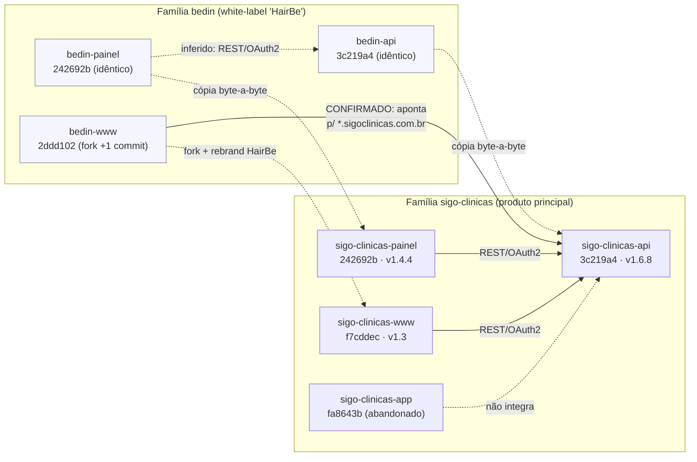

# Diagrama — Repositórios e integrações (famílias sigo e bedin)

**Notas de evidência**
- `bedin-api ≡ sigo-clinicas-api` e `bedin-painel ≡ sigo-clinicas-painel`:
  `diff -rq` vazio, mesmo commit/histórico.
- `bedin-www`: fork linear de `sigo-clinicas-www` + 1 commit ("ajustes iniciais")
  que troca marca visível → "HairBe" e sobe Node 10→20; **API/CI/Docker
  permanecem sigoclinicas** → risco de deploy cruzado (ver `docs/09` R9).
